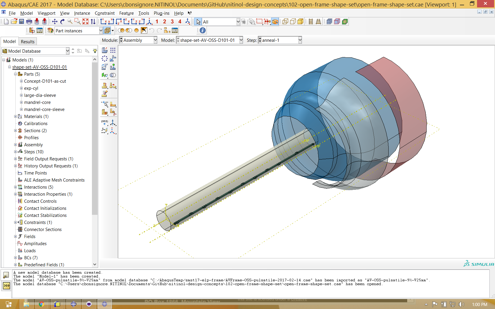
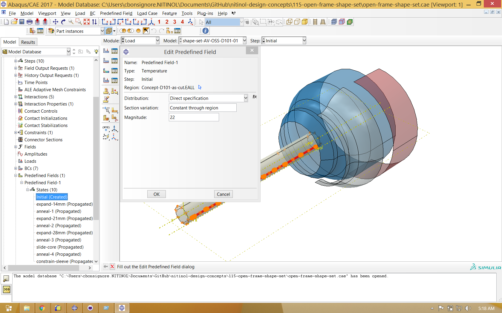

# Shape Setting

**Objective:** Expand a laser cut tubing component into a complex formed shape, using simulation to replicate the shape transformation in each physical heat treatment step. The output of this exercise is an expanded finite element model representing the finished component, and suitable for crimping or fatigue simulations.

**Prerequisites:** [NDC-105 Design](../105-open-frame-design), [NDC-110 Mechanical Properties](../110-mechanical-properties), SIMULIA Abaqus 2017.

## Introduction

In [NDC-105 Design](../105-open-frame-design) and [NDC-110 Mechanical Properties](../110-mechanical-properties), we created a design and characterized the material from which it is to be fabricated. Now it's time to dive into the world of computational simulation using finite element analysis (FEA), starting with an expansion analysis. 

We are often asked why use FEA to create expanded geometry; why not just create an expanded 3D geometry in Solidworks instead? Well, nitinol components are commonly formed in several steps, with intermediate heat treatments between each step. Each step imparts subtle influences in the shape, curvature, bend, and twist of design features that are difficult (or perhaps impossible) to replicate using conventional CAD. By matching the virtual expansion process step-for-step with the physical process, we can ensure that the virtual geometry is an accurate match with its physical counterpart. In fact, in a first iteration expansion simulation, a mismatch is quite common! The design, simulation, and prototyping cycle often includes adjustments to modeling assumptions (and/or physical tooling) to converge on a solution that matches the design intent. Let's get started!

## SIMULIA Abaqus

This example uses Abaqus 2017, a commercial finite element analysis package from Dassault Systèmes SIMULIA. This is the most widely used FEA package for nitinol computational simulation, and includes a material constitutive model designed specifically for unique characteristics of superelasticity. This model, based on the work of [Auricchio and Taylor](http://www.sciencedirect.com/science/article/pii/S0045782596011474) is based on a principle of additive strain decomposition. With this approach, the strain in each element can be a combination of an elastic, transformation, or plastic components. While there are more advanced constitutive models in development, the Abaqus implementation is well tested, robust, and still widely used. The superelasticity model can be used with Abaqus Standard for quasi-static simulations, or Abaqus Explicit for dynamic simulations. This example uses Standard, which is typically our first choice for nitinol medical component simulations.

We will assume that the reader is familiar with creating, running, and troubleshooting simulations in Abaqus. If you have access to the Simulia knowledge base, some helpful resources includes: [UMAT and VUMAT routines for the elastic-plastic simulation of Nitinol](https://kb.dsxclient.3ds.com/mashup-ui/page/resultqa?from=search%3fq%3dQA00000009225&id=QA00000009225e&q=QA00000009225), [Abaqus Technology Brief: Simulation of Implantable Nitinol Stents](https://kb.dsxclient.3ds.com/mashup-ui/page/resultqa?from=search%3fq%3dQA00000009132&id=QA00000009132e&q=QA00000009132), and [Best practices for stent analysis with Abaqus/Standard and Abaqus/Explicit](https://kb.dsxclient.3ds.com/mashup-ui/page/resultqa?from=search%3fq%3dQA00000008135&id=QA00000008135e&q=QA00000008135).

The original Abaqus CAE model files for this example are available for download in this GitHub project. We will not address every detail of the model, so please explore the model and input file in addition to reading through this guide.

## Import and Partition

The first step is to import and partition the ACIS (.SAT) file from [NDC-105 Design](../105-open-frame-design), in this case a single strut representing the smallest symmetrical repeating section of the component. The first objective is to split the imported geometry into well divided solid segments, thus enabling the meshing algorithm to create well formed hexahedral elements. This case required a few dozen partitions throughout the part geometry. This can be a bit tedious, and usually requires some iteration between the Part and Mesh modules until all the solid cells turn green or yellow, indicating their eligibility for ruled or swept meshing. 


## Mesh

In this example, the nitinol component is meshed with at least four elements across each feature, the absolute minimum for any simulation. Typically at least six to eight elements are required to reach strain convergence. We typically use C3D8R elements, brick shaped elements with six faces, eight nodes, and a single centered integration point. Because this is a reduced integration element, it is prone to shear locking, so an hourglass stiffness must be applied to compensate for this (checking "enhanced" in the mesh control dialog is usually sufficient). At this step, it is convenient to define a local cylindrical coordinate system coaxial with the component, having an r, theta, and Z axis aligned with the tubing material, and define a material orientation for the nitinol component that references this coordinate system. 


## Properties

Abaqus 2017 includes native [superelasticity](http://help.3ds.com/2017/english/dssimulia_established/simacaematrefmap/simamat-c-superelasticity.htm?contextscope=all) and [plasticity models for superelastic materials](http://help.3ds.com/2017/english/dssimulia_established/simacaematrefmap/simamat-c-plastsuperelastic.htm?contextscope=all) (documentation links require current Abaqus credentials). This example uses the prior convention, which is still supported, and can be implemented in previous Abaqus releases. Material parameters are derived from tensile testing results as explained in [NDC-110 Material Properties](../110). The image below shows a view of the interactive material definition dialog in Abaqus CAE, and the code below show the resulting lines in the input file.
```
*Material, name=ABQ_SUPER_ELASTIC_PLASTIC_Af19
*Depvar
     31,
*User Material, constants=32, unsymm
62857.,  0.33,27778.,  0.33, 0.046,  6.52,  460.,  500.
   37.,  6.52,  240.,  210.,  690.,    0.,    0.,    8.
 1170., 0.087, 1240., 0.091, 1320., 0.095, 1370., 0.099
 1440., 0.106, 1460., 0.112, 1500.,  0.12, 1510., 0.128
```


## Forming Tools

Next, parts must be created to represent each of the forming tools that will be used to shape the component. In simple cases, these tools may be simple cylinders. Complex components may require contoured tools that engage the inner or outer surface of the component. Forming tools are typically modeled as rigid bodies, and may be defined as extruded or revolved surfaces as shown below. Each tool must have a reference point defined, as well as a surface to contact the nitinol component.


## Assembly

Each of the components is added to the assembly, and aligned in a colinear fashion. The image below is a partially transparent view of the assembly with each part positioned as necessary at the beginning of the simulation. In some cases, it may be necessary for tooling to expand (or contract) radially, and in some cases tooling may need to advance axially. The initial position of each tool relative the nitinol component will depend upon the forming strategy, and may also require some iteration as the simulation is developed.


## Interactions

Each step of the forming analysis is driven by contact interactions. Contact pairs are defined between the outer or inner surface of the nitinol component and the appropriate tool(s), and enabled or disabled as necessary at each step using the interaction manager as shown below.


## Boundary Conditions

As with the interactions, boundary conditions are created or modified for each step of the analysis. It is important to remember that the material property definition includes a reference temperature, and the mechanical properties shift according to the model temperature relative to that reference temperature. Therefore, the initial temperature of the model must be defined as a "predefined field". In this case, we apply a temperature of 22 degrees C, and therefore stresses correspond to those expected at room temperature.



## Field Outputs

For the expansion analysis, the only essential field output is displacement U for the final frame of the final step. It is usually also interesting to report strain LE and superelasticity internal state variables SDV as well, including at intermediate steps.


## Credits

This model was developed by Karthikeyan Senthilnathan, [@karthikSenthi](https://github.com/karthikSenthi), of Confluent Medical Technologies.
