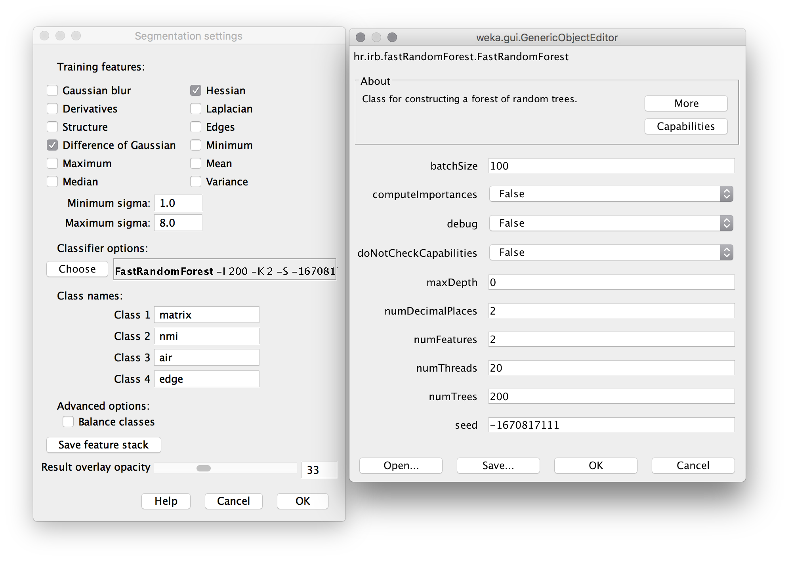
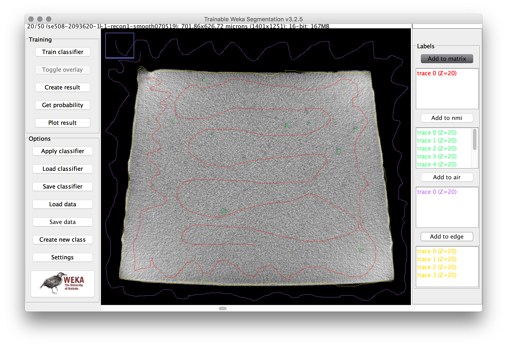
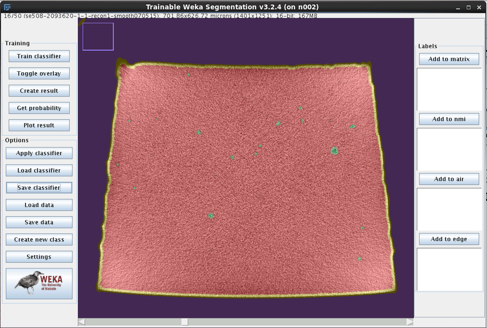
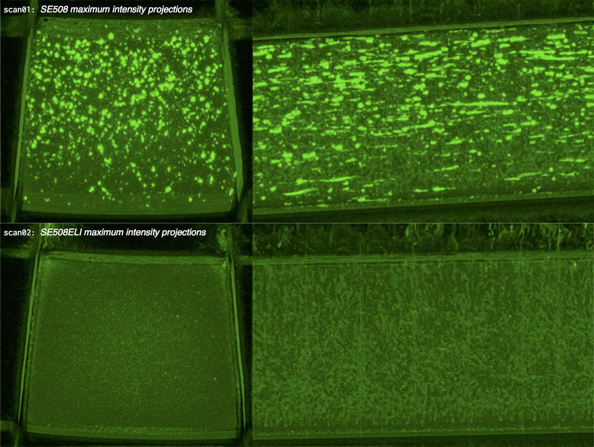
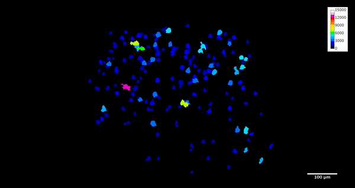
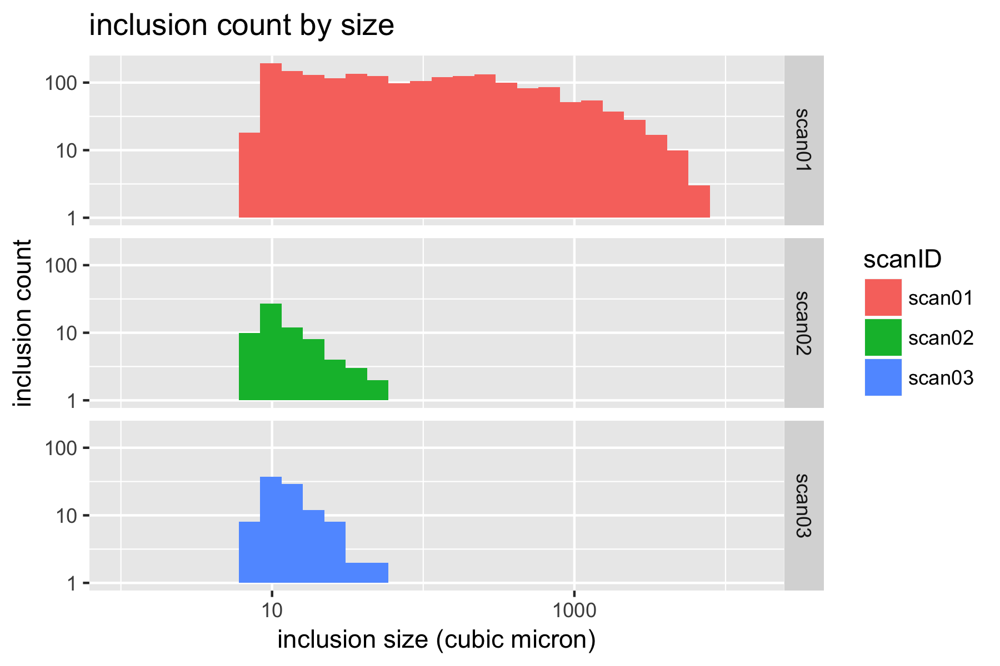

# Volumetric characterization of inclusions from submicron CT scans

**Objective:** Characterize the density, size, shape, and orientations of inclusions in a sample of nitinol material based on submicron resolution x-ray computed tomography scan results. 

**Prerequisites:** X-ray computed tomography microscope. This study utilized a [ZEISS Xradia 520 Versa instrument at Stanford Nano Shared Facilitiess](https://snsf.stanford.edu/equipment/xsa/xct.html).

**Resources:** The original scan images can be downloaded from the 210-xct-methods folder at [nitinol.app.box.com/v/nitinol-design-concepts](https://nitinol.box.com/v/nitinol-design-concepts), and the code and results for the analysis documented here can be found at the [210-xct-methods](https://github.com/cbonsig/nitinol-design-concepts/tree/master/210-xct-methods) folder of this [nitinol-design-concepts](https://github.com/cbonsig/nitinol-design-concepts/) GitHub repository.

## Introduction

[NDC-205 Advancing Nitinol Fatigue Durability Prediction](../205-advancing-fatigue-prediction) reviews limitations of our current practice of fatigue lifetime prediction, and proposes some possibilities for advancing our predictive capabilities. Material purity (or conversely impurity) is an important factor in fatigue performance, as fractures virtually always originate at the location of a surface or near-surface impurity. Conventional metallurgical cross-sectioning techniques provide a two-dimensional view of impurities, typically in selected longitudinal and transverse planes. This information is useful, but can not be directly applied to a three dimensional structural analysis without making significant assumptions.

X-ray computed tomography (XCT) methods can provide a three-dimensional view of a sample volume of material. Until recently, sub-micron resolution XCT scans required a high energy beam source, such as a synchrotron, and were therefore inaccessible for routine characterization. We have found that modern commercially available XCT instruments are capable of resolving impurities commonly found in standard nitinol material. This exercise reviews methods used to obtain such an XCT scan for a nitinol tubing sample, and derive a "fingerprint" of the inclusions contained within.

##  Material

This study considers standard purity (SE508) and high purity (SE508ELI) material. Each specimen was fabricated from tubing material 8.00mm OD x 7.01mm ID according to NDC-03-06673 rev 1, “µCT Matchstick Samples”. Individual “matchstick” shaped samples have a cross section of approximately 0.5mm x 0.5mm, and are approximately 50mm in length. The lot history for each scan:
- `scan01`: SE508, Component Lot 2903620, Material Lot 1003492
- `scan02`: SE508ELI, Component Lot 2093619, Material Lot 1003560
- `scan03`: SE508ELI, Component Lot 2093617, Material Lot 1003711   

## Methods


The flowchart above shows an overview of the method used to scan and analyze three samples of material. The primary steps are outlined in gray boxes and described below.

This guide includes quite a bit of detail, hopefully enough to recreate the results, or repuropse for similar analysis. If you are not acquiring CT datasets yourself, you might want to skip ahead to the next sectioon. This Methods section is divided into four parts, following the gray boxes in the figure above.

[1. Acquisition](#1.-acquisition) \| [2. Classifier Training](#2.-classifier-training) \| [3. Segmentation](#3.-segmentation) \| [4. Analysis](#4.-analysis)

### 1. Acquisition

XCT scans were performed using a [Xradia Versa 520 3D X-ray microscope](https://www.zeiss.com/microscopy/us/products/x-ray-microscopy/zeiss-xradia-520-versa.html) (Carl Zeiss X-Ray Microscopy, Inc., Pleasanton CA) at the [Stanford Nano Shared Facility (SNSF Center)](https://snsf.stanford.edu/). Matchstick samples were secured by a pin vice and placed into the XCT tool between the source and detector. Scan settings were as follows:
- 80 kV source voltage
- 4.00 W power
- 4x objective
- LE6 filter
- Z=-9.5 source position
- Z=54.25 detector position
- 0.501 micron voxel size
- 15 second exposure time per slice (16+ hours total acquisition time)

All scans were conducted and reconstructed using the same settings to ensure that results are consistent between samples. Each scan produced approximately 26GB of raw output in Xradia's TXRM format. Reconstruction was completed following recommended procedures to mitigate beam hardening artifacts. Gaussian filtering was applied with a 0.7 kernel, and the reconstruction was saved in TXM format, approximately 16GB in size. The TXM results were imported into [ORS Visual SI](http://theobjects.com/orsvisual/orsvisual.html) (Object Research Systems, Montreal, Quebec), cropped and exported as a sequence of approximately 2,000 16-bit gray-scale TIFF images, 7 GB in total size. All subsequent analysis was conducted using open source software.

*All of the original TIFF images from each scan are available for download at [https://nitinol.app.box.com/v/nitinol-design-concepts](https://nitinol.app.box.com/v/nitinol-design-concepts) in the folder for this topic, [210-xct-methods](https://nitinol.box.com/s/jt6z3lv6nhtna7zs633lyuo1fpam0yvs)*

### 2. Classifier Training

Scanning through the acquired images, after some simple adjustments to brightness and contrast levels, impurities in the material could be easily observed. The animation below show 50 slices from `scan01`. The dark spots are the inclusions that we need to systematically identify in each frame. This process is called "segmentation".


Image analysis was conducted using the [Fiji](https://fiji.sc/) distribution of [ImageJ](https://imagej.net), an open source software tool widely used for image processing and analysis. Conventional segmentation approaches require subjective judgments to select threshold levels, and often require manual adjustments to compensate for gradients or variations in background intensity. For this reason, repeatability and reproducibility is quite challenging. 

To overcome this challenge, a machine learning segmentation method was developed and applied to each scan in this series. The [Trainable WEKA Segmentation](http://imagej.net/Trainable_Weka_Segmentation) ImageJ plugin, included with Fiji, was used to assign each voxel a probability of being one of four classes:

1. **Matrix:** Nitinol material, including bulk nickel-titanium, as well as inclusions and/or voids.
2. **NMI:** Non-metallic inclusion, voids, or other embedded particles.
3. **Edge:** A trace of the border between matrix and air.
4. **Air:** Empty space surrounding the sample.

A 50-slice subset of the `scan01` image stack was used to train the model. The training process is manual and iterative, and each iteration requires computationally intensive processing. The following steps were first completed using a MacBook Pro Core i5 system with 16GB RAM.

1. Launch Fiji distribution of ImageJ
2. Open [scan01-0500-0549.tif](https://nitinol.box.com/s/7eywwq3ml46c0potmr4khkkah3elgfcv) (167MB 16-bit grayscale TIFF)
3. Adjust threshold to improve visibility of particles. Image > Adjust > Window/Level. Level should be set to about 50700, and Window to about 11000.
4. Launch Weka segmentation: Plugins > Segmentation > Trainable Weka Segmentation 3D
5. Create a total of four classes (click "Create new class" twice)
6. Click Settings. Apply settings and classifier options as shown below. The "Difference of Gaussians" feature compares progressively blurred copies of each frame to detect blob-like particles. The "Hessian" feature detects gradients, and is sensitive to edges and particle orientation. [Machine Learning as a tool for classifying electron tomographic reconstructions](https://link.springer.com/article/10.1186/s40679-015-0010-x) is a 2015 open-access paper by Staniewicz that I found very helpful to understand this. (note: in settings, "numThreads" should be set to the number of available CPU cores; likely 2 or 4 on a personal computer, rather than 20 for a server as shown here.) 
7. Trace a path through the matrix (gray area) of the cross section, then click "add to matrix" in the label area at the right. Repeat this for several of the inclusions, the air, and the edge. Then repeat the process for multiple images in the stack (use the slider at the bottom to adjust the Z position). The image below shows an example training image for one frame. 
8. Click "Train Classifier", then go get at coffee.
9. When complete, each pixel will be assigned a probability of belonging to each of the four classes. Review the result, and if there are obvious mismatches, add more training traces in the problematic area and retrain the model. Repeat until satisfied. 
10. The final classifier model [classifier-0500-0549-3.model](https://nitinol.box.com/s/9d7hp332ppra56dzqnh1r40giamfzacb) used for this example can be downloaded from the [nitinol.app.box.com](https://nitinol.box.com/s/kcpbivbdszlqtx9zxsgkq636hfnzbo9p) site.

### 3. Segmentation

Now that the classifier model has been trained on a representative subset of images, the next step is to apply the classifier to each of the full scan data sets. The basic process for this is as follows:

#### 3.1 Apply Weka Classifier

1. From Fiji, launch Plugins > Segmentation > Trainable Weka Segmentation 3D.
2. When prompted for a file, open an image stack to be segmented.
3. Click "Load Classifier" and open the final classifier model from above.
4. Click "Apply Classifier" and then go get some more coffee.

We will pause here to address some complications. This process is extraordinarily memory and processor intensive. Using a high performance engineering server with 256GB of RAM and 20 CPU cores, each scan needed to be divided into about several sub-stacks, each no larger than about 1GB in size. After several minutes of effort, the result is multi-channel 32-bit TIFF probability map. Each channel corresponds to a class (matrix, nmi, edge, or air), and the intensity of each pixel in the stack corresponds to the probability of that pixel belonging to the class.

32-bits of probability resolution is more than we will need for now. After completing segmentation of each sub-stack, we will next distill this data down to something we can use.

#### 3.2 Create a mask to isolate the volume of interest

5. Batch convert the 32-bit probability maps to 8-bit TIFF's. ImageJ: Process > Batch > Convert. Output = 8-bit TIFF.
6. Reassemble the sub-stacks into a single merged TIFF file. ImageJ: File > Import > Image Sequence... Select the sub-stack TIFF's to merge.
7. Split the channels into separate files for each class. ImageJ: Image > Stacks > Tools > Deinterleave. Discard the matrix, and save the nmi, air, and edge classes.
8. Threshold the air and edge stacks to create a binary black and white image for each. ImageJ: Image > Adjust > Threshold...
9. Combine the air and edge to create a new mask stack. We will use this to define the volume to disregard in the subsequent analysis. ImageJ: Process > Image Calculator
10. Clean up the mask to remove any unwanted areas, using erosion (Process > Binary > Erode > (Close-), and the ImageJ shape tools and flood fill tools as necessary. This may require some iteration.
11. Create a histogram of this volume, and save to file called (prefix)-mask-histogram.tsv. ImageJ: Analyze > Histogram > click "List" > right click results table > Save as...

Now we have created the first of three output files that will be used by the analysis script in the next section. `scan01-mask-histogram.tsv` is an example of this output, the count of pixels with a value of 255 represent the volume of the matrix, and those with a value of 0 represent the disregarded volume of the mask.

#### 3.3 Isolate inclusions

12. Next, create a new image to isolate the particles of interest (inclusions). We will combine the "nmi" stack with the "mask" stack, selecting the minimum pixel value at each location. Therefore the black pixels from the mask will effectively delete the air and edge regions from the combined stack. ImageJ: Process > Image Calculator > Minimum (nmi, mask)
13. Now we can threshold the masked nmi probability map. Here, some judgment is required, because we must select a probability threshold to use for deciding how to select particles. To keep it simple, we will use a 50% probability threshold (an intensity of 128 on an 8-bit scale of 0-255). ImageJ: Adjust > Threshold > 128,255 > options: default, light, no checkboxes checked.
14. Invert the lookup table, so particles are shown in white, with an intensity of 255. ImageJ: Image > Lookup Table > Invert LUT
15. Save this stack as an 8-bit image

We now have a binary 8-bit image stack, where white voxels represent particles (inclusions or voids). The next series of steps uses the MorphoLibJ library to measure the count these particles, and measure their size, location, and orientation.

#### 3.4 Morphological calculations

[MorphoLibJ](http://imagej.net/MorphoLibJ) is MorphoLibJ is a collection of mathematical morphology methods and plugins for ImageJ, created at [INRA-IJPB Modeling and Digital Imaging lab](http://www-ijpb.versailles.inra.fr/en/bc/equipes/modelisation-imagerie/). Source code and installation details can be found at [https://github.com/ijpb/MorphoLibJ/](https://github.com/ijpb/MorphoLibJ/).

In the next steps, we start with the 8-bit binary image stack from above, with particles represented by white (255), and absence of particles represented by black (0). Individual particles are typically composed of a cluster of contiguous white pixels. In the first step, we find these connected clusters, and assign each one a unique 16-bit label number. The result of this step is a "labeled image", with pixel intensity representing the label (particle or inclusion) to with each pixel belongs. With the labeled image prepared, two additional routines are run to collect morphology data, including the centroid position, volume, and orientation of each inclusion.

16. Select the 8-bit binary inclusion image, and create a 16-bit labeled image. ImageJ: Plugins > MorphoLibJ > Binary Images > Connected Components Labeling. Options: connectivity = 6, 16-bit output.
17. Measure morphological characteristics of the labeled particles. ImageJ: Plugins > MorphoLibJ > Analyze > Particle Analysis 3D. Save the resulting table in the default format, a tab separated text file. `scan01-lbl-morpho.tsv` is an example of this result.
18. Report bounding box details for each particle, which will be used later to characterize orientation, and estimate the area projected into each cartesian plane. ImageJ: Plugins > MorphoLibJ > Analyze > Nounding Box 3D. As above, save in the default format. `scan01-lbl-bounds.tsv` is an example of this result.

#### 3.5 Visualizing morphological results

ImageJ provides a variety of methods to visualize complex volumetric data sets. One useful approach for visualizing three dimensional data is to create a *maximum intensity projection*, which projects the maximum voxel intensity through a solid volume to a selected plane. The images below show maximum intensity 0 degree and 90 degree projections of the 8-bit NMI probability map for `scan01` (standard purity SE508 material) and `scan02` (high purity SE508ELI material).

 

ImageJ can also create animations to visualize the size, position, and orientation of inclusions throughout the volume. The animation below was created using the MorphoLibJ "assign measure to label" function to label each particle according to its volume in cubic microns.

 

### 4. Analysis

The previous sections document the process for distilling a 26GB scan into three small text files containing a numerical representation of inclusion locations and morphology. Examples of these can be found here in the [image-data](image-data) folder:

* [scan01-mask-histogram.tsv](image-data/scan01-mask-histogram.tsv)
* [scan01-lbl-morpho.tsv](image-data/scan01-lbl-morpho.tsv)
* [scan01-lbl-bounds.tsv](image-data/scan01-lbl-bounds.tsv)

#### 4.1 R for Data Analysis

Our next task is to visualize these results, and create a mathematical model to represent the probabilistic and volumetric distribution of inclusons found in each scan. This will be completed with the R script [xct-process-imagej-results.R](xct-process-imagej-results.R). R is an open source programming language and software environment for statistical computing and graphics, and is quite useful for data analysis tasks such as this. [RStudio](https://www.rstudio.com/) is freely available for all computing platforms, and [R for Data Science](http://r4ds.had.co.nz/) is an excellent primer on this environment.

The [xct-process-imagej-results.R](xct-process-imagej-results.R) code is documented throughout, and some of the important steps are summarized here.

#### 4.2 Import morphology data

Some setup information is defined at the top of the script, including the cutoff volume, and volume per voxel. A cutoff volume of 8 cubic microns is selected for this example, meaning that we only consider particles (inclusions) with a volume equal or greater than 8 cubic microns. This corresponds to nominally a 2 micron edge length, or 4xx4x4=64 voxels.

```Rscript
cutoffVolume <- 8 # filter out particles less than this value (cubic microns)
umPerVoxel <- 0.500973555972 # voxel edge size from scan (microns)
```

The `getSegmentation` function compiles all of the data from the above noted `*.tsv` files into a data table. It takes arguments `baseName` and `description` which define the prefix of the file names (e.g. scan01) and description of the material represented by that scan (e.g. SE508).

```Rscript
getSegmentation <- function(baseName, description){
```

The first few lines of this function get the count of black (value 0) and white (value 255) pixels in the mask image stack, and use this to calculate the total volume and volume of the matrix.

```Rscript
histogram000 <- read_tsv(paste0('./image-data/',baseName,'-mask-histogram.tsv'),skip=1,col_names=FALSE)
histogram255 <- read_tsv(paste0('./image-data/',baseName,'-mask-histogram.tsv'),skip=256,col_names=FALSE)
voxels000 <- histogram000[[1,2]]
volume000 <- voxels000 * cubicUmPerVoxel
voxels255 <- histogram255[[1,2]]
volume255 <- voxels255 * cubicUmPerVoxel
totalVolume <- volume255 + volume000
matrixVolume <- volume255
```

Next, a new data frame called `morpho` is created and filled with the results from MorphLibJ Particle Analysis 3D. This data frame now contains a row for each inclusion, and columns for volume, position, and other features.
```Rscript
morpho <- read_tsv(paste0('./image-data/',baseName,'-lbl-morpho.tsv'),col_names=TRUE)
```

Next, the bounding box data is read into a new data frame, and converted from pixel units to microns. Unnecessary columnds are discarded, and the micron denominated bounding box sizes are added to the `morpho` data frame.
```Rscript
bounds <- read_tsv(paste0('./image-data/',baseName,'-lbl-bounds.tsv'),col_names=TRUE) %>%
mutate(xBox = (XMax-XMin)*umPerVoxel,
       yBox = (YMax-YMin)*umPerVoxel,
       zBox = (ZMax-ZMin)*umPerVoxel) %>%
select(xBox,yBox,zBox)
morpho <- bind_cols(morpho,bounds)
```

This function is called to several times to build a new data frame `xct` containing results for each scan of interest.

```Rscript
xct <-      getSegmentation('scan01','SE508') %>%
  bind_rows(getSegmentation('scan02','SE508ELI')) %>%
  bind_rows(getSegmentation('scan03','SE508ELI')) %>%
  filter(Volume > cutoffVolume) %>%
  mutate(vPerCuMm = Volume / 1e9)
```

#### 4.3 Visualize inclusion size and distribution

With all of this data consolidated in a single table, we can now create some histograms to visualize the distribution of inclusions. It is convenient to use a log-log scale to visualize these results.

```Rscript
p.count.ll <- ggplot(xct) +
  geom_histogram(aes(Volume,fill=scanID)) +
  facet_grid(scanID ~ .) +
  scale_y_log10() +
  scale_x_log10(limits = c(1,NA)) +
  xlab('inclusion size (cubic micron)') +
  ylab('inclusion count') +
  ggtitle('inclusion count by size')
plot(p.count.ll)
```


#### 4.4 Report inclusion density

We can now summarize inclusion density as follows.

```Rscript
countByScan <- xct %>%
  group_by(scanID,scanDesc) %>%
  summarize(vMatrix = max(vMatrix)) %>%
  bind_cols(inclusionCount[,2]) %>%
  mutate(nPerUm3 = n/vMatrix,
         nPerMm3 = nPerUm3 * 1e9)
print(countByScan)
```
```
  scanID scanDesc   vMatrix     n      nPerUm3   nPerMm3
  <fctr>   <fctr>     <dbl> <int>        <dbl>     <dbl>
1 scan01    SE508 256463759  1917 7.474740e-06 7474.7403
2 scan02 SE508ELI 247278718    68 2.749933e-07  274.9933
3 scan03 SE508ELI 255549689   103 4.030527e-07  403.0527
```
Inclusion density by scan, and consolidated by description (material type), are saved as text files, such as [count-by-scan.csv](out/count-by-scan.csv) and [count-by-type.csv](out/count-by-type.csv).

#### 4.5 Estimate defect size in each plane

In fracture mechanics, defect size is commonly expressed as the square root of defect area projected in a plane normal to an applied stress. Inclusions are often modeled as defects, so for our purposes, it will be useful measure the root-area size of inclusions, in each Cartesian plane.

```Rscript
xct <- xct %>%
  mutate(xyArea = Volume / zBox, # area projected in XY plane (transverse)
         xzArea = Volume / yBox, # area projected in XZ plane (longitudinal)
         yzArea = Volume / xBox, # area projected in YZ plane (longitudinal)
         rootXyArea = xyArea^(1/2),
         rootXzArea = xzArea^(1/2),
         rootYzArea = yzArea^(1/2))
```

#### 4.6 Gumbel fit for defect sizes

It has been observed that the size of nonmetallic inclusions in (nitinol and other metals) follows an [extreme value distribution](https://en.wikipedia.org/wiki/Generalized_extreme_value_distribution). We will use the `fitdistrplus` R package to create a Gumbel fitting function, and use this to fit the root-area data for each plane, and each scan, as shown below.

```R
gumbelFit <- function(vector){
  fit <- fitdist(vector, "gumbel",
                 start=list(mu=4, s=1),
                 method="mle")
  return(fit)
}
xct.se508 <- filter(xct,scanDesc=='SE508')
gumbel.se508.xz <- gumbelFit(xct.se508$rootXzArea)
gumbel.se508.yz <- gumbelFit(xct.se508$rootYzArea)
gumbel.se508.xy <- gumbelFit(xct.se508$rootXyArea)
``` 

A new data frame is created to summarize the results for each condition, including Gumbel parameters mu and sigma, are written to [gumbel-parameters.csv](out/gumbel-parameters.csv).

```
   matl plane cutoff   nPerMm3       mu         s
  <chr> <chr>  <dbl>     <dbl>    <dbl>     <dbl>
1 se508    xy      8 7474.7403 2.836400 1.3627438
2 se508    yz      8 7474.7403 3.586776 1.9563104
3 se508    xz      8 7474.7403 3.550664 1.8617355
4   eli    xy      8  340.0763 1.768962 0.4022094
5   eli    yz      8  340.0763 2.056096 0.3980918
6   eli    xz      8  340.0763 2.267019 0.4506382
```

## Next

This example documents feasible methods for distilling volumetric computed tomography image data into a compact mathematical "fingerprint", describing  inclusion density, distribution, size, and orientation in just a few numbers. The next topic in this series, [NDC-215](215-xct-fea), will explore methods for improved fatigue durability prediction, combining this information with results of finite element analysis.

## Acknowledgment

Part of this work was performed at the Stanford Nano Shared Facilities (SNSF)  using the ZEISS Xradia 250 Versa, acquired with support from the NSF under award [CMMI-1532224](https://www.nsf.gov/awardsearch/showAward?AWD_ID=1532224). SNSF is supported by the NSF as part of the National Nanotechnology Coordinated Infrastructure under award [ECCS-1542152](https://www.nsf.gov/awardsearch/showAward?AWD_ID=1542152).


