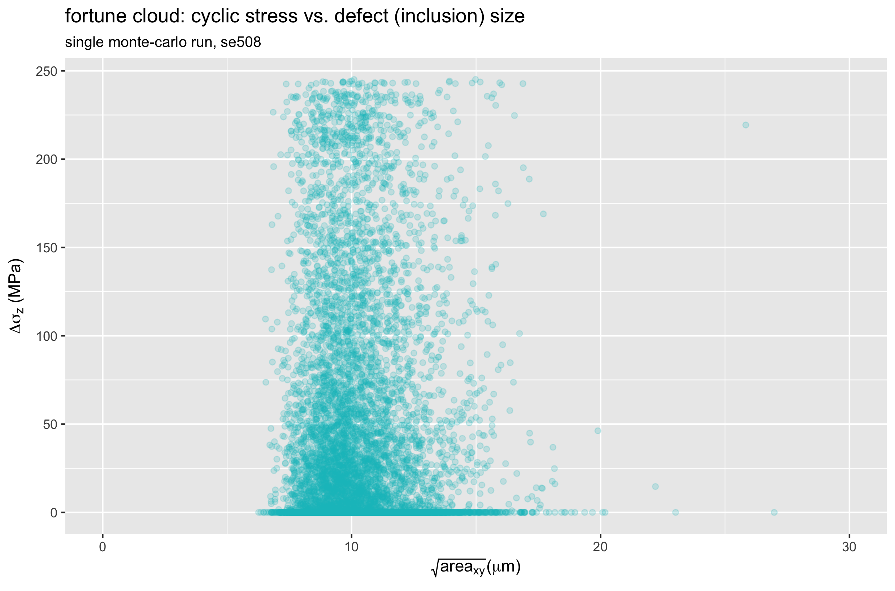
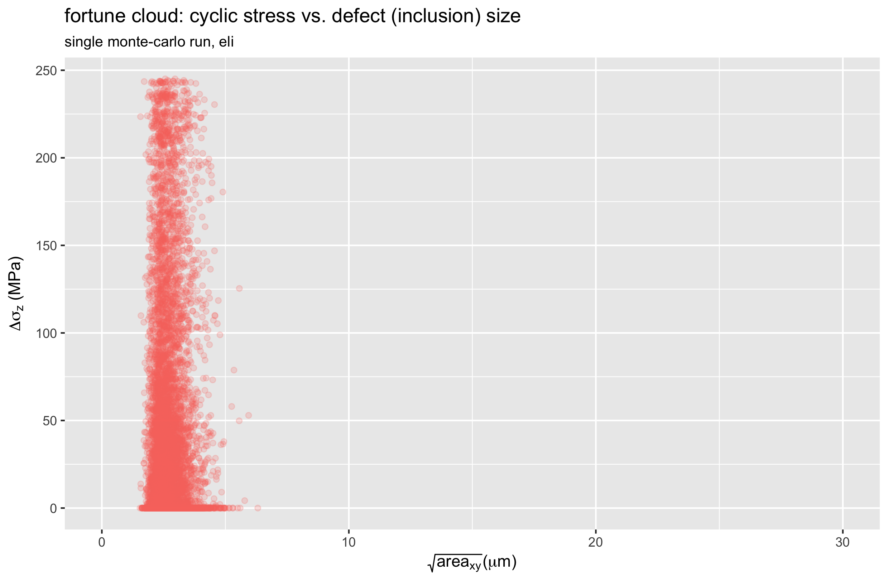
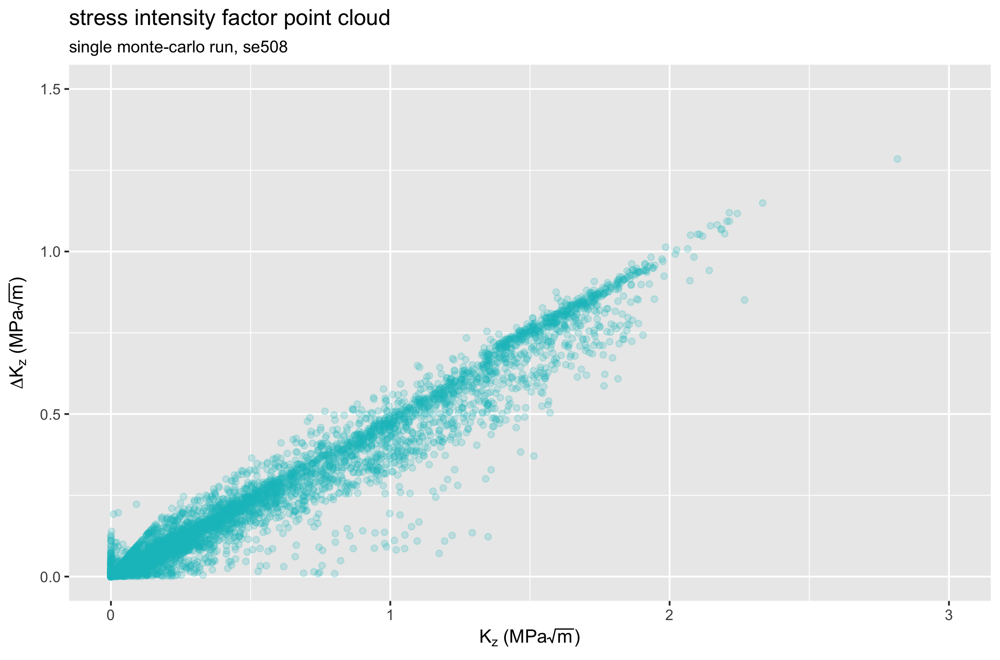
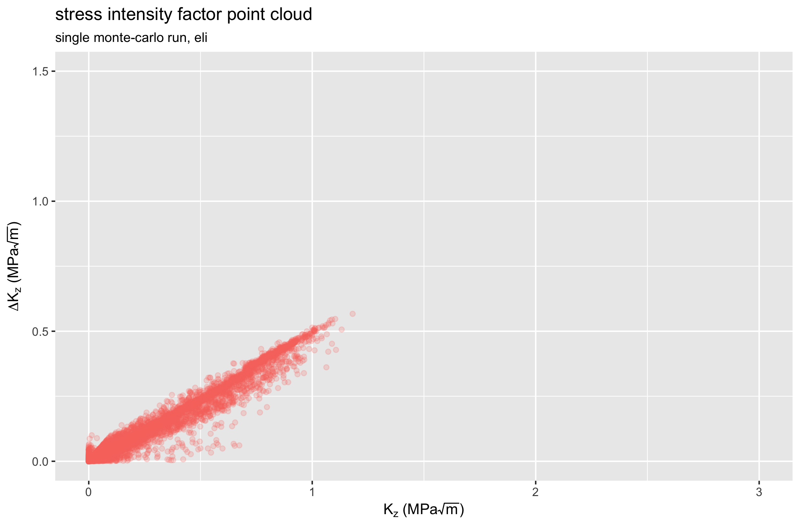
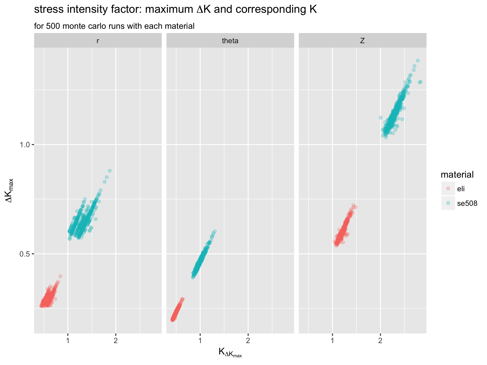
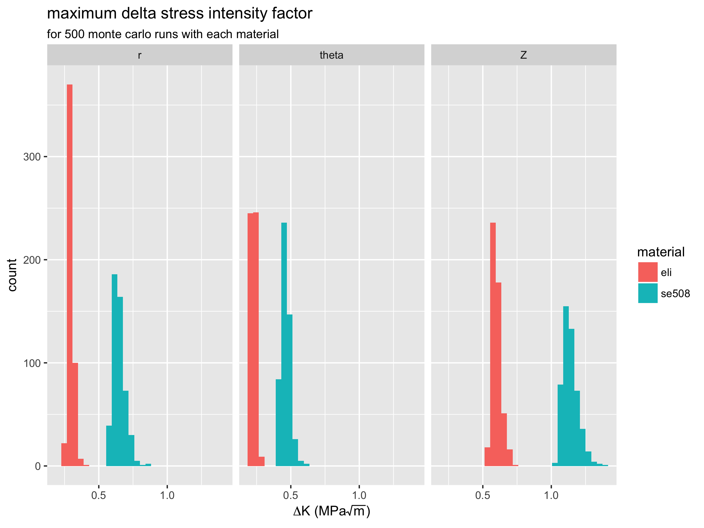

# Probabilistic durability prediction using Monte-Carlo methods

**Objective:** Develop a durability prediction method that considers the probability of critical regions co-located with material defects.

**Prerequisites:** [Open Frame Design](../105-open-frame-design), [Open Frame Shape Set](../115-open-frame-shape-set), [Open Frame Fatigue Analysis](../120-open-frame-fatigue), [Volumetric FEA Postprocessing](125-volumetric-analysis), [Volumetric characterization of inclusions from submicron CT scans](../210-xct-methods), [RStudio](https://www.rstudio.com/)

**Resources** R scripts and related plots used for this example can be found in [this repository](https://github.com/confluentmedical/nitinol-design-concepts/blob/master/215-monte-carlo/).

## Introduction

Having completed all of the prerequisites listed above, we are now prepared for the main event. The sub-micron x-ray CT topic proposed methods for characterizing inclusion density, size, shape, and orientation with a few simple parameters. The FEA post-processing topic proposed methods for extracting volumetric and oriented stresses and strains for an example geometry and load case. This topic is intended to bring these new methods together, and use this information to develop new insights into durability prediction.

## Stress intensity factor, K

To achieve this objective, we will need to decide upon a fatigue indicator parameter that considers both defect size _and_ stress/strain at each material point of interest. For this, we propose stress intensity factor K, from the field of fracture mechanics. Urbano et al proposed the formulation of K in the open access SMST journal paper "[Inclusions Size-based Fatigue Life Prediction Model of NiTi Alloy for Biomedical Applications](http://link.springer.com/article/10.1007/s40830-015-0016-1)", referencing earlier work of Murakami and Endo, "[Effects of Hardness and Crack Geometries on AK, h of Small Cracks Emanating from Small Defects.](http://www.gruppofrattura.it/ocs/index.php/esis/EGF1/paper/viewFile/9663/6375)". In this formulation, defect (inclusion) size is expressed as the square root of the projected area of the inclusion in a plane perpendicular to the cyclic stress.


It is proposed that delta-K, the change in stress intensity factor K during the fatigue cycle, is the driving force for fatigue crack growth, and therefore fracture. K and delta-K can be expressed for each direction in a Cartesian coordinate system as follows:


Note that these formulations apply a factor of 0.65 to estimate the maximum value of K associated with a surface defect. Murakami also proposes that a 0.50 factor is appropriate for an internal defects([Metal Fatigue, Effects of Small Defects and Nonmetallic Inclusions. Page 16](https://scholar.google.com/scholar?lookup=0&q=Metal+Fatigue,+Effects+of+Small+Defects+and+Nonmetallic+Inclusions&hl=en&as_sdt=0,5&as_vis=1)). The methods we propose can not currently account for the location of inclusions or critical stress regions relative to the surface, so we conservatively assume the larger 0.65 factor.

## Gumbel quantile function

In a previous chapter, we characterized inclusion density and distribution from CT scans, and distilled the results into a table: [gumbel-parameters.csv](https://github.com/confluentmedical/nitinol-design-concepts/blob/master/210-xct-methods/out/gumbel-parameters.csv). Now, we need to develop a method to create a random sampling of inclusions according to this distribution. To do so, we use the Gumbel _quantile function_ to determine the root-area size of a random inclusion:


If we evaluate this function Q(U) with U drawn from a uniform distribution between 0 and 1, it will return values according to the Gumbel distribution with the given location and scaling parameters sigma and mu. This will be an essential part of our upcoming algorithm, because it will allow for variation in the size of inclusions between runs, just as inclusion size and location will vary between physical components.

## Setup

[monte-carlo-fea.R](https://github.com/confluentmedical/nitinol-design-concepts/blob/master/215-monte-carlo/monte-carlo-xct-fea.R) is an R script that assesses K and delta-K for based on the volumetric output from a selected FEA model, combined with a selected material. It will repeat this as many times as desired; each run is a "roll of the dice", with a random selection of inclusion sizes throughout the geometry. Before starting the randomly repeating part of the script, we have to attend to some housekeeping.

First, we define where to find the results of our volumetric post-processing, and the symmetry multiplier to apply the model to represent the actual volume of the physical component.

```R
inputPath <- '../125-volumetric-analysis/out/'
modelName <- 'open-frame-fatigue-v25mm-9pct'
symmetry <- 16
```

Next, we define material signatures, shown below for the SE508 material. They are hard coded here, but could have been read automatically from [gumbel-parameters.csv](https://github.com/confluentmedical/nitinol-design-concepts/blob/master/210-xct-methods/out/gumbel-parameters.csv). We include the volumetric probability (density) of inclusions per cubic millimeter, and Gumbel parameters for root-area defect size in each plane. 

```R
gumbel.se508 <- list(probV=7474.7403,
                     id='se508',
                     cutoff=8,
                     xy=list(mu=2.836400, s=1.3627438),
                     yz=list(mu=3.586776, s=1.9563104),
                     xz=list(mu=3.550664, s=1.8617355))
```
There are some other data tidying steps that we'll skip over here, but you can read the comments in [monte-carlo-fea.R](https://github.com/confluentmedical/nitinol-design-concepts/blob/master/215-monte-carlo/monte-carlo-xct-fea.R) if you want to know more.

## Monte-Carlo Algorithm

These next few steps are repeated for each run, or "roll of the dice". Here, we introduce some elements of randomness, so each run has a different distribution of inclusions. 

First, we need to determine the number of inclusions to be assigned to each integration point in the simulation. We know the volume associated with each point, and we know the volumetric probability (inclusion density), so this should be easy: `iProb = probV * cycV` (inclusion probability = volumetric probability for this material * volume at this point). There is a problem: `iProb` is not a whole number, but we need to have an integer number of inclusions associated with each integration point. And we can't use simple rounding rules, because then integration points with N<0.5 will _never_ be assigned an inclusion. Instead, if `iProb=0.5`, we want that inclusion to receive one inclusion half of the time, and zero inclusions half of the time. To do this, we'll need to create a rounding function that takes probability into account:

```R
roundProb <- function(x){
  xFloor <- floor(x)                       # integer part of the number
  xDec <- (x-xFloor)                       # fractional part of the number
  zeroOne <- rbinom(1,size=1,prob=xDec)    # 0 or 1 with fractional probability
  return(xFloor + zeroOne)
}
```

We can now use this function to assign an integer number of inclusions to each integration point: `iN = roundProb(iProb)`. This takes care of randomizing the number of inclusions associated with each point in the model.

Now, we can move onto randomly assigning the inclusion size to each of those inclusions. In the code below, if the point is assigned one or more inclusions, we "roll the dice" `iN` times, each time choosing a random number from a uniform distribution between 0 and 1. We save the maximum result from `iN` trials, because we assume that the largest inclusion will dominate the behavior at that material point. We give this random number to the Gumbel quantile function described above. It will return the root area defect size for the given orientation, following the extreme value distribution that we derived from the x-ray CT material scans. There is a possibility for this function to return a very small negative number, so we also set negative numbers to zero to avoid confusion later.

```R
    df <- df %>%
      filter(iN > 0) %>%
      mutate(rnd = max(runif(iN,0.0,1.0)),
             xyD = qgumbel(rnd,gumbel$xy$mu,gumbel$xy$s),
             yzD = qgumbel(rnd,gumbel$yz$mu,gumbel$yz$s),
             xzD = qgumbel(rnd,gumbel$xz$mu,gumbel$xz$s),
             xyD = ifelse(xyD<=0,0,xyD),
             yzD = ifelse(yzD<=0,0,yzD),
             xzD = ifelse(xzD<=0,0,xzD))
 ```

Now we have established the maximum defect size for each orientation at each integration point, so all we have left to so is calculate the value of the stress intensity factor K and delta-K for each orientation, at each point. We use the formula described above, converting defect size in microns to meters, so the resulting units are in MPa root-meters, consistent with conventions for reporting K values.

```R
    df <- df %>%
      mutate(k11  = (0.65 * ldS11 * (pi * yzD/10^6)^0.5),
             k22  = (0.65 * ldS22 * (pi * xzD/10^6)^0.5),
             k33  = (0.65 * ldS33 * (pi * xyD/10^6)^0.5),
             dK11 = (0.65 * dS11 *  (pi * yzD/10^6)^0.5),
             dK22 = (0.65 * dS22 *  (pi * xzD/10^6)^0.5),
             dK33 = (0.65 * dS33 *  (pi * xyD/10^6)^0.5)
      )
```

Finally, we find the integration point that has the maximum value of dK in each orientation. We assume this will be these will be the most critical values for each run, so we'll save them for reporting later.

## Example results for a single run

Recalling that our stress intensity factor is related to the product of stress and defect size, let's create a scatter plot of these values for a single run of each material. For now, we will consider only the Z (axial) orientation.




Let's call these "fortune clouds", because they tell us something about how lucky (or unlucky) each run was. The upper right corner is the most unlucky region of these plots, as this represents the largest possible defect coinciding with the largest possible stress. In the SE508 case, we can see one particularly unlucky point with a defect size over 25 microns, and a stress range of about 220 MPa. 

Let's take a look at the K and delta-K values the we calculate for every point in the model, for the same single runs of each material. The plots below show a different expression of a point cloud: delta-K _vs._ K for one SE508 run, and one ELI run. Again, both cases consider only the Z (axial) direction.




Comparing these two plots, we see that the ELI material experiences lower K values, and smaller changes in K during the fatigue cycle. Therefore, we expect ELI material to have better fatigue performance, confirming previously reported results. Note, however, that these plots represent a single physical instance for each case. If we repeat the Monte-Carlo simulation hundreds or thousands more times, we can expect these point clouds to change every time. How much do they change? Let's roll the dice and find out.

## Execute 500+500 Monte-Carlo runs

We run the script 500 times for SE508 material by defining the variables near the top of [monte-carlo-fea.R](https://github.com/confluentmedical/nitinol-design-concepts/blob/master/215-monte-carlo/monte-carlo-xct-fea.R) as follows:

```R
monteCarloRuns <- 500
material <- 'se508' # se508 or eli
set.seed(42)
```

Note that we have defined a random seed value, which makes the results reproducible. If you want to have a truly random result, different every time, remove or comment out this line. Also note that you'll want to delete or rename the output .CSV file before running this script, because otherwise it will append to the previously created file. To create another 500 runs for the ELI material, simply change the material variable to `material <- 'eli'`. When this has been completed, you should have a file `mc-out\open-frame-fatigue-v25mm-9pct.mc.csv` with 1000 rows of data, 500 for each material. I renamed this to [mc-out\open-frame-fatigue-v25mm-9pct-500se508-500eli.mc.csv](https://github.com/confluentmedical/nitinol-design-concepts/blob/master/215-monte-carlo/mc-out/open-frame-fatigue-v25mm-9pct-500se508-500eli.mc.csv).

## Visualize Monte-Carlo results

As noted above, we'll make the assumption that for each run, the point with the maximum value of delta-K is the most critical point in the model. Therefore, we recorded data related to this point for each run, and we can examine it more closely here.



These plots show that the Z (axial) orientation appears to be more critical than the longitudinal orientations for this example. They also show that the ELI material has consistently lower maximum delta-K values compared with SE508 material. In fact, the highest maximum delta-K value for SE508 is always lower than the lowest maximum delta-K value for ELI material.

Next, let's look at "fortune clouds" plotting the stress and defect size associated with the maximum delta-K for the Z (axial) orientation, for 500 runs of both materials.


Here again, the upper right is the unlucky corner. The density of points in this region relates to the probability of such an unlucky combination to occur. Comparing SE508 with ELI, we again see the benefit of material purity; the ELI results have consistently lower values, and are less scattered compared with SE508.

Finally, we can visualize the distribution of delta-K values for both materials, and each orientation.



Again, we can see the that delta-K values are lower and less scattered for ELI compared with SE508 material. This is consistent with experimental results which show ELI to have superior fatigue durability performance.

## Discussion

We have successfully demonstrated methods that combine inclusion size and distribution with stresses derived from computational simulation, and provide quantitative measures related to fatigue durability. Much work remains to be done to improve our understanding of both the methods and results. Watch this space for more information related to experimental testing results, and possible new variations of these methods.

## Credits

These methods were developed by Craig Bonsignore, [@cbonsig](https://github.com/cbonsig) and Ali Shamimi, of Confluent Medical Technologies, based on models created by Karthikeyan Senthilnathan of Confluent, and building on the work of Payman Saffari of Engage Medical Device Services. Previous works of Scott Robertson and Alan Pelton, among many others, were essential to the ideas proposed here. 