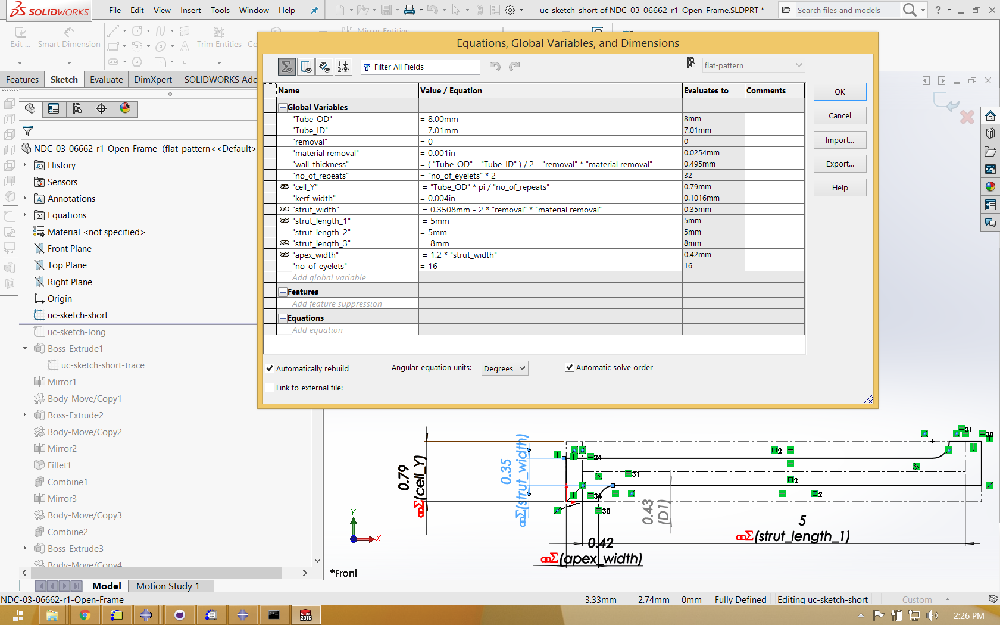
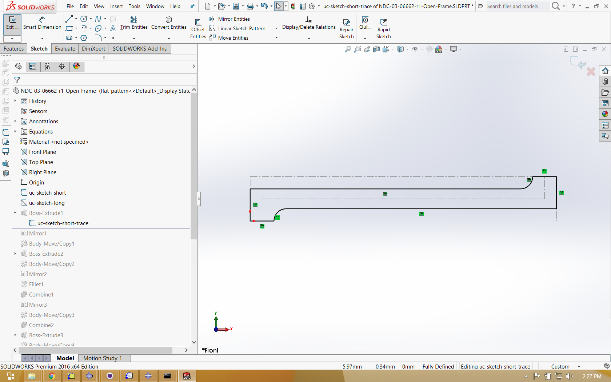
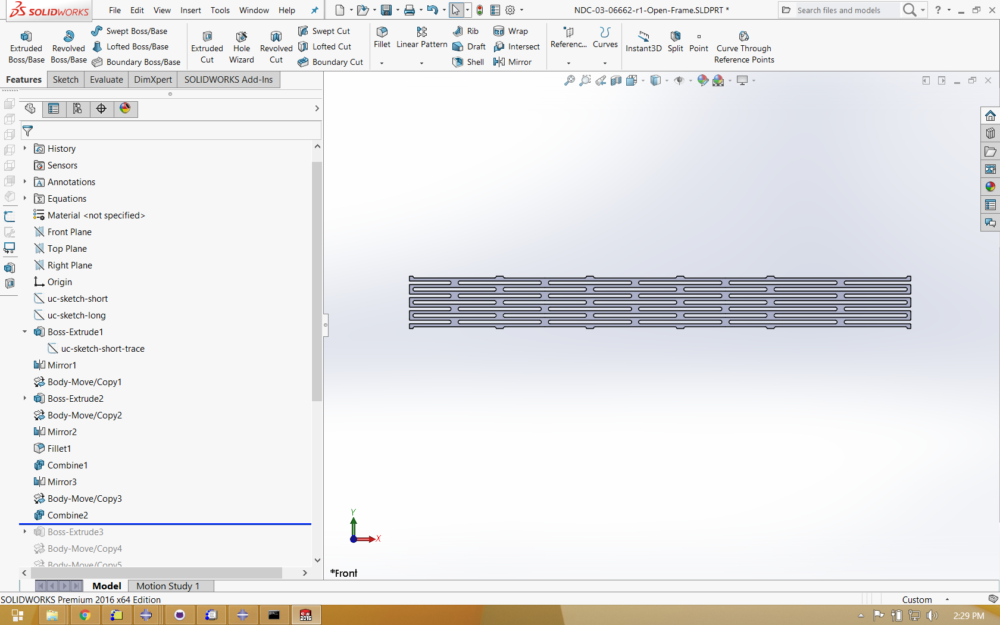
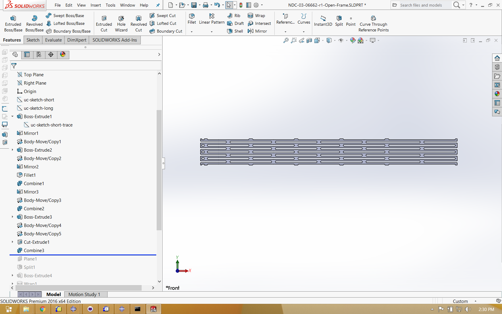
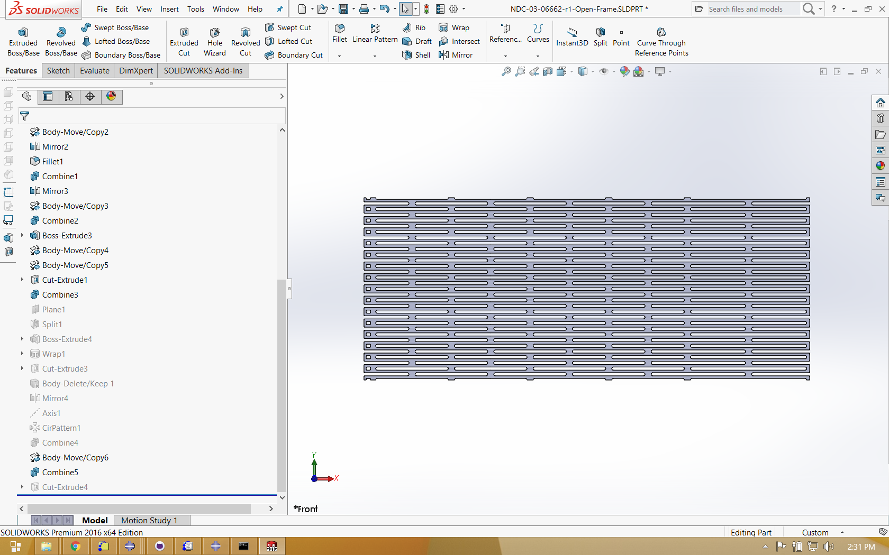
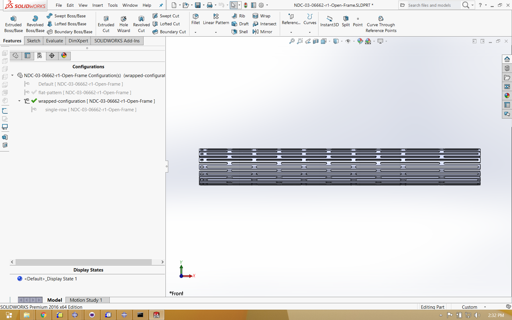
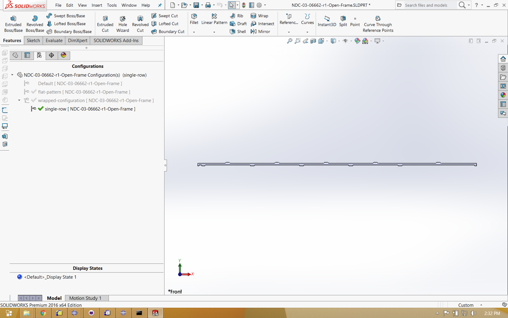

# Design

**Objective:** Create a 3D solid expandable frame design suitable for laser cutting from nitinol tubing, including a planar form to create a toolpath, a wrapped form to visualize the actual geometry, and a symmetrical subset for finite element analysis. 

**Prerequisites:** Solidworks 2016.

## Introduction

Many nitinol medical components take the form of expandable patterned stuctures laser cut from tubing, including vascular stents, vena cava filters, neurovascular clot retreivers, and transcatheter heart valve frames. In this design example, we will extend methods described in [Open Stent Design](https://github.com/cbonsig/open-stent) to create an expandable frame similar in form to nitinol components used for transcatheter valves. This frame is expanded to a contoured diameter ranging from 28-40mm, and can be crimped to a profile of 10mm. A real medical component would have strict performance requirements for radial stiffness, fatigue durability, and crimped profile, for a range of expected clinical loading conditions. Fortunately for us, this example design is unconstrained by any of those concerns! It only needs to look cool, and hopefully teach us something about how to create similar structures that may be more useful.


This example assumes that the reader is familiar with parametric solid modeling using Solidworks. [Open Stent Design](https://github.com/cbonsig/open-stent) provides much more step-by-step detail for creating a similar model, and [Generic IVC Filter](https://github.com/kenaycock/Generic-IVC-Filter) applies these methods to a different type of design. The native Solidworks 2016 files for this example are available from this GitHub repository, and some highlights are shown below.

## Equations and Sketches

Stents and stent-like structures are often composed of repeating patterns of similar features. Commonly, designers will seek to consider many variations of a common architecture, each with a specific adjustment of feature dimensions, such as strut width, strut length, or wall thickness. As such, it is convenient to a build *parametric* solid model, with feature dimensions driven by equations and variables as shown below.

```
"Tube_OD"= 8.00mm
"Tube_ID"= 7.01mm
"removal"= 0
"material removal"= 0.001in
"wall_thickness"= ( "Tube_OD" - "Tube_ID" ) / 2 - "removal" * "material removal"
"no_of_repeats"= "no_of_eyelets" * 2
"cell_Y"= "Tube_OD" * pi / "no_of_repeats"
"kerf_width"= 0.004in
"strut_width"= 0.3508mm - 2 * "removal" * "material removal"
"strut_length_1"= 5mm
"strut_length_2"= 5mm
"strut_length_3"= 8mm
"apex_width"= 1.2 * "strut_width"
"no_of_eyelets"= 16
```
When creating feature sketches, these variables can be used in place of numerical values. With this approach, feature dimensions can be easily changed for the entire structure by simply changing the value of these global variables, then regenerating the model. The equations and first sketch in this Solidworks model are shown below.


## Planar configuration

To understand how this model is constructed, it is helpful to "roll back" the model tree, and progressively rebuild the geometry step by step. The image sequence below illustrates how features are created, mirrored, and copied to create a planar solid model representing an "unwrapped" configuration of the geometry.





## Wrapped configuration

In Solidworks, it is possible to create multiple *configurations* of a single part, each with different features enabled or disabled. In the image below, the planar solid features are disabled, and a wrapped solid is generated in its place, derived from the same driving global variables and equations.


## Single strut

A final configuration is created to isolate a single strut from the wrapped model. This geometry is exported in ACIS format (with a .SAT extension) to be improted into Abaqus for partitioning, meshing, and finite element analysis.

