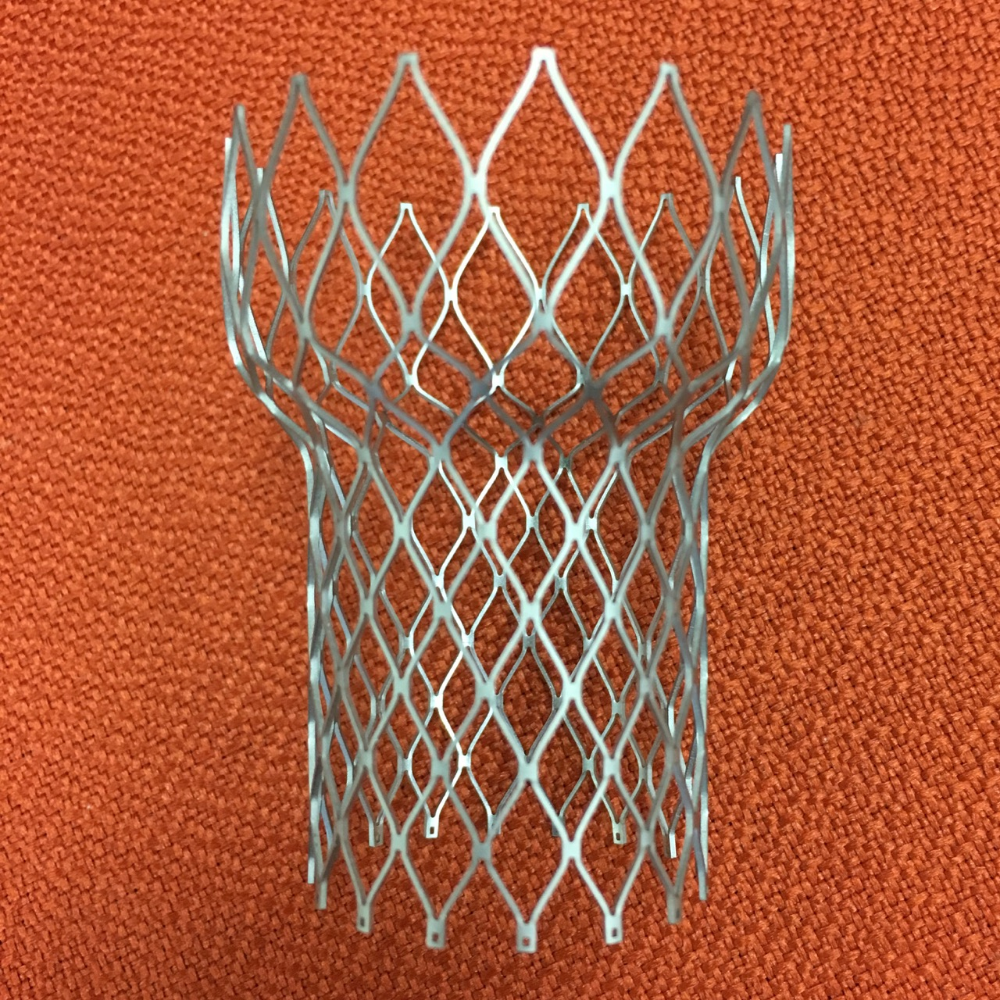

# Design

**Objective:** Create a 3D solid expandable frame design suitable for laser cutting from nitinol tubing, including a planar form to create a toolpath, a wrapped form to visualize the actual geometry, and a symmetrical subset for finite element analysis. 

**Prerequisites:** Solidworks 2016.

## Introduction

Many nitinol medical components take the form of expandable patterned stuctures laser cut from tubing, including vascular stents, vena cava filters, neurovascular clot retreivers, and transcatheter heart valve frames. In this design example, we will extend methods described in [Open Stent Design](https://github.com/cbonsig/open-stent) to create an expandable frame similar in form to nitinol components used for transcatheter valves. This frame is expanded to a contoured diameter ranging from 28-40mm, and can be crimped to a profile of 10mm. A real medical component would have strict performance requirements for radial stiffness, fatigue durability, and crimped profile, for a range of expected clinical loading conditions. Fortunately for us, this example design is unconstrained by any of those concerns! It only needs to look cool, and hopefully teach us something about how to create similar structures that may be more useful.


## Equations and Sketches

Stents and stent-like structures are often composed of repeating patterns of similar features. Commonly, designers will seek to consider many variations of a common architecture, each with a specific adjustment of feature dimensions, such as strut width, strut length, or wall thickness. As such, it is convenient to a build *parametric* solid model, with feature dimensions driven by equations and variables as shown below.

```
"Tube_OD"= 8.00mm
"Tube_ID"= 7.01mm
"removal"= 0
"material removal"= 0.001in
"wall_thickness"= ( "Tube_OD" - "Tube_ID" ) / 2 - "removal" * "material removal"
"no_of_repeats"= "no_of_eyelets" * 2
"cell_Y"= "Tube_OD" * pi / "no_of_repeats"
"kerf_width"= 0.004in
"strut_width"= 0.3508mm - 2 * "removal" * "material removal"
"strut_length_1"= 5mm
"strut_length_2"= 5mm
"strut_length_3"= 8mm
"apex_width"= 1.2 * "strut_width"
"no_of_eyelets"= 16
```
